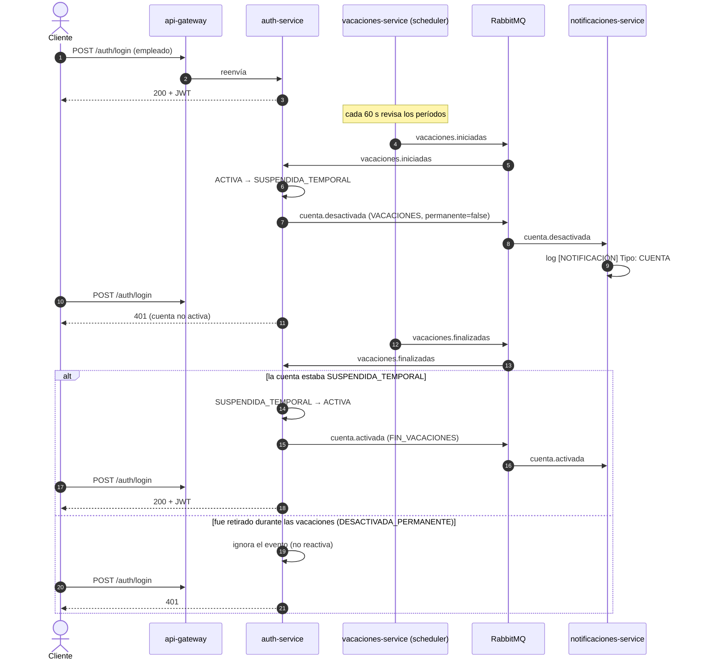

# Sistema de Onboarding/Offboarding de Empleados — Retos 4 y 5

Sistema de microservicios para gestionar empleados, con comunicación REST
síncrona, comunicación asincrónica por eventos a través de un message broker y,
desde el Reto 5, **autenticación con JWT**, control de acceso por rol y ciclo de
vida automático de las cuentas. Un solo evento (por ejemplo, crear un empleado)
dispara acciones automáticas e independientes en otros servicios.

## Arquitectura

```
Cliente HTTP (curl, Postman, navegador)
        │   único punto de entrada: http://localhost:8080
        ▼
   api-gateway  (valida el JWT y aplica RBAC antes de reenviar)
        ├── /auth/*            ──► auth-service             ──► MySQL (db-auth)
        ├── /empleados/*       ──► empleados-service        ──► MySQL
        ├── /departamentos/*   ──► departamentos-service    ──► PostgreSQL
        ├── /perfiles/*        ──► perfiles-service         ──► SQLite
        ├── /notificaciones/*  ──► notificaciones-service   ──► SQLite
        └── /vacaciones/*      ──► vacaciones-service       ──► SQLite

   message-broker (RabbitMQ) — exchange "ecosistema.eventos"
     empleados-service  ── publica ──► empleado.creado / actualizado / retirado
     vacaciones-service ── publica ──► vacaciones.programadas / iniciadas / finalizadas
     auth-service       ── publica ──► usuario.creado / usuario.recuperacion
                                       cuenta.activada / cuenta.desactivada
     perfiles, notificaciones, auth-service ◄── consumen
```

Comunicación síncrona: `empleados-service` → `departamentos-service` (valida el
departamento) y `vacaciones-service` → `empleados-service` (valida el empleado).
Se publican al host el Gateway (`8080`), el broker (`5672` y la interfaz `15672`)
y la base de `auth-service` (`3307`, solo para inspección); el resto usa
`expose:` y solo es alcanzable dentro de la red de Docker.

## Servicios y lenguajes

| Servicio | Lenguaje | Base de datos | Puerto interno | Rol |
|---|---|---|---|---|
| `api-gateway` | Node.js (Express) | — | 8080 (publicado) | Punto de entrada único; valida JWT y aplica RBAC |
| `auth-service` | Java (Spring Boot) | MySQL 8 | 8086 | Login, recuperación y cambio de contraseña, ciclo de vida de la cuenta |
| `empleados-service` | Java 21 (Spring Boot) | MySQL 8 | 8080 | CRUD, baja lógica, publica `empleado.*` |
| `departamentos-service` | Python (FastAPI) | PostgreSQL 16 | 8081 | CRUD de departamentos |
| `perfiles-service` | C# (.NET) | SQLite | 8083 | Consume `empleado.*`; REST de perfiles |
| `notificaciones-service` | Go | SQLite | 8084 | Consume eventos; historial de notificaciones |
| `vacaciones-service` | JavaScript (Node.js) | SQLite | 8085 | CRUD de vacaciones; scheduler de inicio y fin de períodos |
| `message-broker` | RabbitMQ 3 | — | 5672 (interno), 15672 (UI) | Mensajería asincrónica |

## Despliegue

Requisito: Docker Desktop corriendo.

```bash
git clone https://github.com/JeffersonRodriguezV/Proyecto-Microservicios.git
cd Proyecto-Microservicios
cp .env.example .env          # en Windows (PowerShell): copy .env.example .env
docker compose up --build
```

El archivo `.env` define `JWT_SECRET` (mínimo 32 caracteres) y **no se sube al
repositorio**. Sin él, `docker compose` se detiene con un mensaje claro: el
secreto nunca tiene un valor por defecto. Cámbielo por uno propio si va más allá
de un uso académico.

En otra terminal, `docker compose ps` debe mostrar los **11 contenedores**
`healthy`. URL base de todo el sistema: `http://localhost:8080`. Interfaz del
broker: `http://localhost:15672` (usuario `admin`, contraseña `admin`).

- Detener conservando los datos: `docker compose down`
- Reiniciar desde cero (borra todos los datos): `docker compose down -v`

### Administrador semilla

Al arrancar, `auth-service` crea el usuario administrador:
`admin@empresa.com` con la contraseña de la variable `ADMIN_PASSWORD`
(por defecto `Admin123!`, solo para uso académico).

## Seguridad (Reto 5)

### Flujo de autenticación

1. `POST /auth/login` con `{email, password}` devuelve un JWT firmado (HS256).
2. El cliente envía `Authorization: Bearer <token>` en cada petición.
3. El Gateway valida firma y vigencia **antes de reenviar** y aplica las reglas
   de acceso. `auth-service` y el Gateway comparten el secreto vía `JWT_SECRET`.
4. El claim `sub` del token es el `empleadoId`; el claim `role` es `ADMIN` o `USER`.

### Reglas de acceso (Gateway)

| Situación | Respuesta |
|---|---|
| Sin token, token inválido, alterado, vencido o que no es de acceso | `401 Unauthorized` |
| `ADMIN` | Permitido en todo |
| `USER`, métodos de lectura (`GET`, `HEAD`, `OPTIONS`) | Permitido |
| `USER`, `POST /auth/change-password` | Permitido (cambia su propia contraseña) |
| `USER`, `PUT /perfiles/{id}` con `id == sub` | Permitido (propiedad del recurso) |
| Cualquier otro caso de `USER` | `403 Forbidden` |

Rutas **públicas** (sin token): `POST /auth/login`, `POST /auth/recover-password`,
`POST /auth/reset-password`, `GET /health` y la documentación Swagger.
Si el servicio destino está caído, el Gateway responde `503` en JSON.

### Endpoints de `auth-service`

| Endpoint | Descripción |
|---|---|
| `POST /auth/login` | Devuelve el JWT. Una cuenta que no está activa responde `401`, igual que una credencial incorrecta |
| `POST /auth/recover-password` | Genera un token de recuperación y publica `usuario.recuperacion`. Responde igual exista o no el correo |
| `POST /auth/reset-password` | Establece la contraseña con el token (activación inicial o recuperación) |
| `POST /auth/change-password` | Cambia la contraseña del usuario autenticado |

## Ciclo de vida de la cuenta

`auth-service` modela el estado de la cuenta (no un booleano):
`PENDIENTE_ACTIVACION → ACTIVA ⇄ SUSPENDIDA_TEMPORAL`, y `DESACTIVADA_PERMANENTE`
cuando el empleado es retirado.

| Evento consumido | Acción en `auth-service` | Evento publicado |
|---|---|---|
| `empleado.creado` | Crea la cuenta inactiva con rol `USER` y un token de activación | `usuario.creado` |
| `vacaciones.iniciadas` | Suspende la cuenta de forma temporal | `cuenta.desactivada` (`VACACIONES`, `permanente: false`) |
| `vacaciones.finalizadas` | Reactiva la cuenta **solo si** estaba suspendida | `cuenta.activada` (`FIN_VACACIONES`) |
| `empleado.retirado` | Desactiva la cuenta de forma permanente | `cuenta.desactivada` (`RETIRO`, `permanente: true`) |

**Caso borde:** si un empleado es retirado durante sus vacaciones, al llegar
`vacaciones.finalizadas` la cuenta **no se reactiva**; el servicio registra la
advertencia y el login sigue fallando.

### Diagrama de secuencia



### Scheduler de vacaciones

`vacaciones-service` revisa cada `SCHEDULER_INTERVAL_SECONDS` (60 por defecto) y,
en la zona horaria `TZ` (`America/Bogota`): primero pasa a `FINALIZADA` los
períodos `EN_CURSO` cuya `fechaFin` es anterior a hoy y después pasa a `EN_CURSO`
los `PROGRAMADA` cuya `fechaInicio` ya llegó. Un período de un solo día
(`fechaFin == fechaInicio`) es válido: inicia ese día y termina al siguiente.

- **Limitación (instancia única):** el scheduler corre dentro de cada instancia
  del servicio. Con varias instancias, el mismo evento se publicaría varias veces.
  La deduplicación en el consumidor mitiga el daño, pero no evita el trabajo
  duplicado; la coordinación en el productor (ShedLock) queda para un reto
  posterior. Detalle en [`vacaciones-service/README.md`](./vacaciones-service/README.md).
- **Solo desarrollo:** `POST /vacaciones/{id}/forzar-inicio` y `forzar-fin`
  existen solo si `DEV_ENDPOINTS=true` (variable `VACACIONES_DEV_ENDPOINTS`, activa
  por defecto para poder demostrar el flujo sin esperar días). Desactívela en
  cualquier entorno que no sea de pruebas.

## Rutas del Gateway y documentación OpenAPI

Todos los Swagger se ven **a través del Gateway** y soportan el esquema
`BearerAuth`: haga login, copie el token y péguelo en el botón **Authorize**.

| Ruta externa | Servicio | Documentación Swagger |
|---|---|---|
| `/auth/login`, `/auth/recover-password`, `/auth/reset-password`, `/auth/change-password` | `auth-service` | `http://localhost:8080/auth/swagger-ui.html` |
| `/empleados`, `/empleados/{id}` | `empleados-service` | `http://localhost:8080/empleados/swagger-ui.html` |
| `/departamentos`, `/departamentos/{id}` | `departamentos-service` | `http://localhost:8080/departamentos/docs` |
| `/perfiles`, `/perfiles/{empleadoId}` | `perfiles-service` | `http://localhost:8080/perfiles/swagger` |
| `/notificaciones`, `/notificaciones/{empleadoId}` | `notificaciones-service` | `http://localhost:8080/notificaciones/docs` |
| `/vacaciones`, `/vacaciones/{id}` | `vacaciones-service` | `http://localhost:8080/vacaciones/api-docs/` |
| `/health` | El propio Gateway | — |

Cada servicio publica su documentación bajo su propio prefijo, así el Gateway la
reenvía sin reglas adicionales, y declara el servidor `/` para que *Try it out*
use el host del Gateway.

## Eventos

Siguen el **Catálogo de Eventos** del ecosistema (nombres, envelope y cargas
útiles sin cambios). Todos usan el envelope `{id, type, version, occurredAt,
producer, data}` y se publican en el exchange `ecosistema.eventos` (tipo
`topic`), con el nombre del evento como routing key. Cada consumidor tiene su
propia cola durable.

