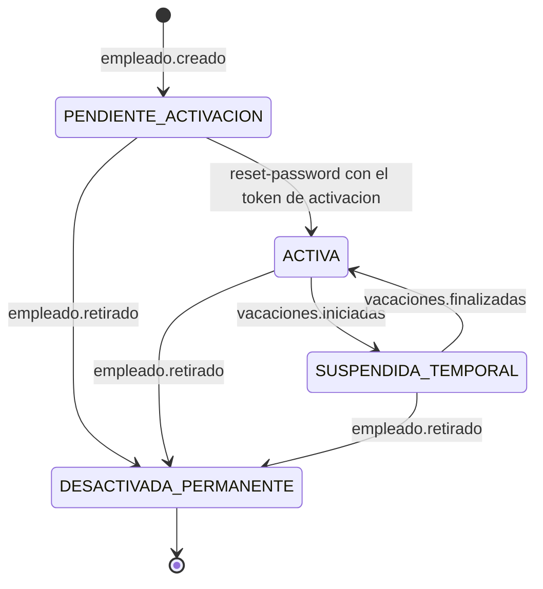
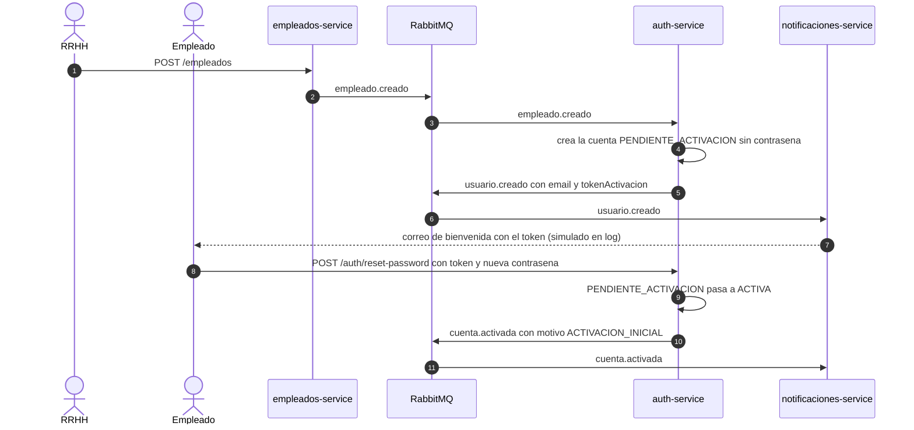
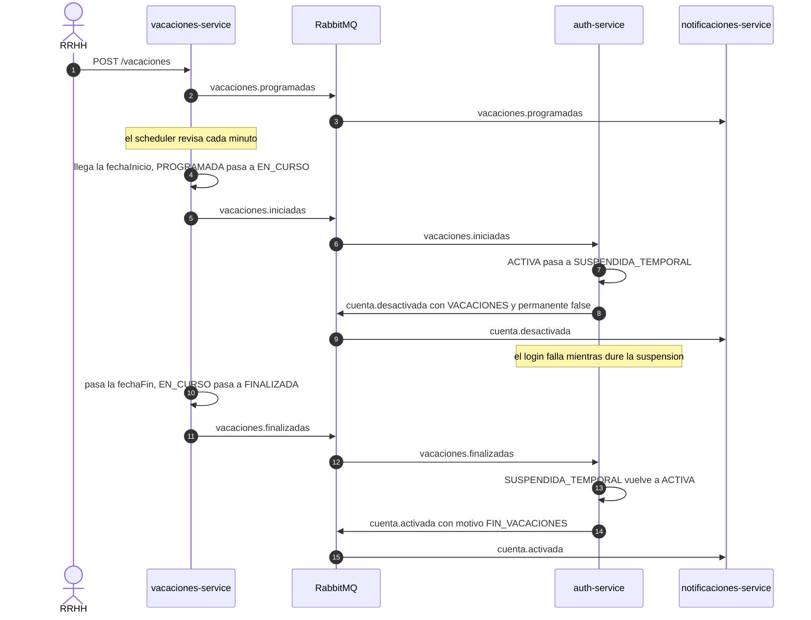
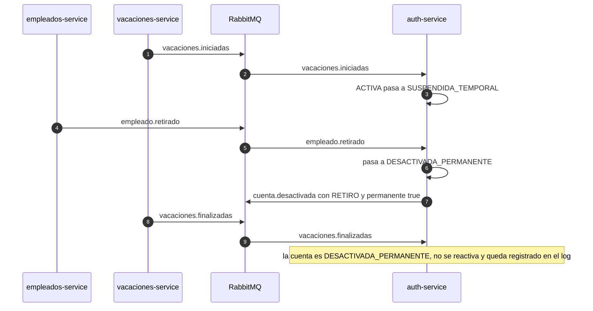

# Ciclo de vida de la cuenta (Reto 5)

La cuenta de acceso de un empleado la gobiernan los eventos del ecosistema. El `auth-service` consume cuatro
(`empleado.creado`, `empleado.retirado`, `vacaciones.iniciadas`, `vacaciones.finalizadas`) y publica los que
consume `notificaciones-service`.

## Estados de la cuenta

`DESACTIVADA_PERMANENTE` es terminal: ningún evento posterior la reactiva. Por eso se modela como estado propio y no como un booleano.

## 1. Alta y activación

## 2. Vacaciones: suspensión y reactivación

## 3. Caso borde: retiro durante las vacaciones

Si el empleado es retirado mientras está de vacaciones, al llegar la `fechaFin` el evento `vacaciones.finalizadas`
**no** debe reactivar la cuenta.

